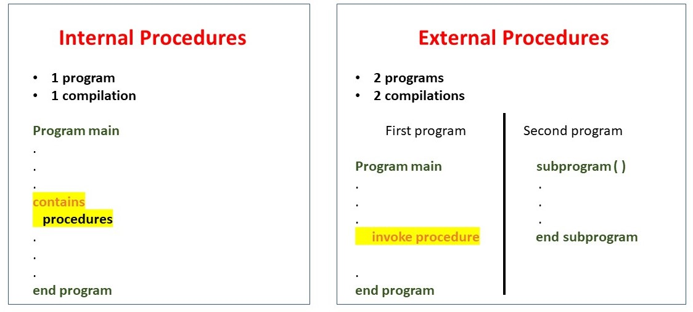
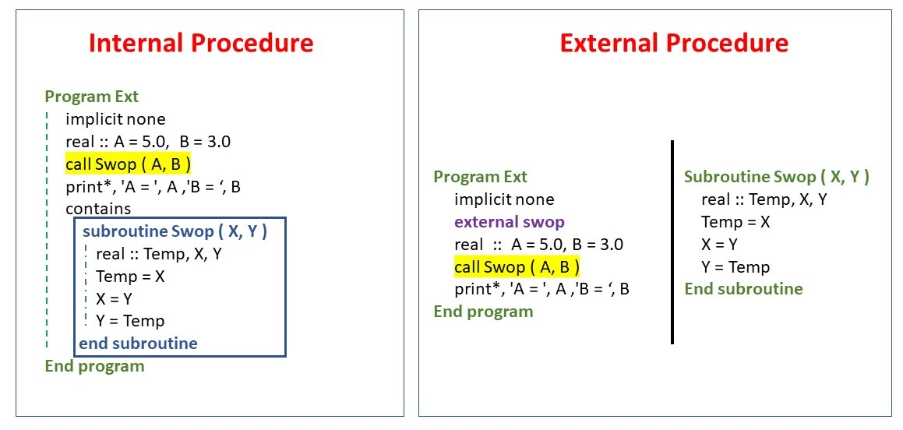
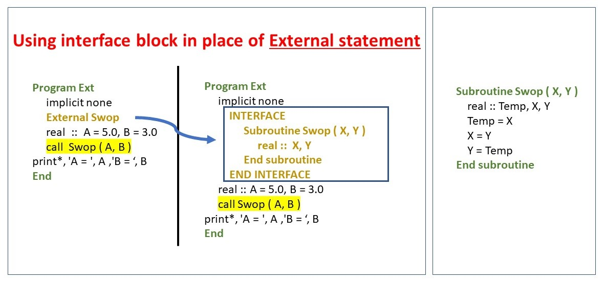
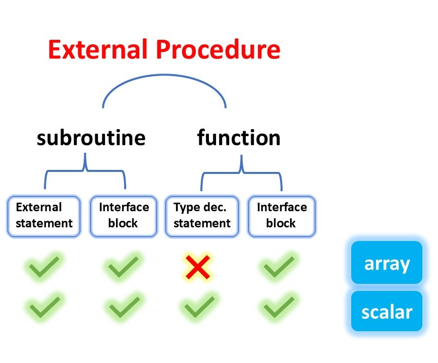
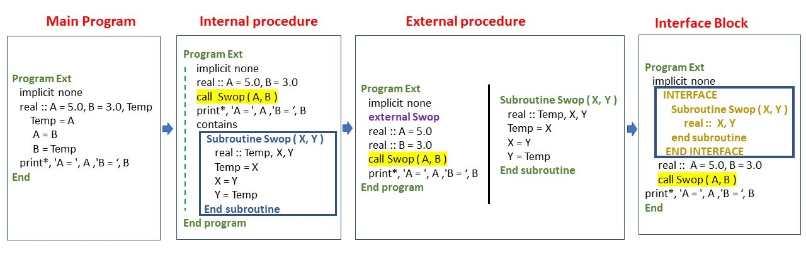

<!---  <style>H1{color:Blue;}</style> --->

<!---  <style>H2{color:DarkOrange;}</style> --->

<!---  <style>p{color:Black;}</style> --->

# **External Procedures programming paradigm**

The repository introduces the concept of

* EXTERNAL procedures
* INTERFACE blocks

 for the Fortran phase-field codes. 

## **Introduction**

[Previously](https://github.com/Shahid718/Fortran-Phase-field-codes-using-Internal-Procedures) we have shown how to use internal sub-programs ( procedures ) for the phase field codes. Now, we will explore how to make them external to use them in the main program.

**The basic idea** of the external procedures is to 

* Separate the main program from the internal sub-programs
* Put sub-programs in the separate files



We can see that the **internal procedures** are part of the same source code file as the calling code. They are easier to read and maintain as the procedure code is located nearby the calling code. They have access to main variables. However, they offer limited reusability, as the internal procedure is only available within the scope of the program unit where it's defined.

The **external procedures**, on the other hand, can be compiled and linked independently from the main program, allowing for better modularization and code organization. They offer higher reusability, as external procedures can be used across multiple program units and projects. They encourage modular design; can be compiled and maintained separately, reducing compilation times for large projects. But the downside is that they require proper linking of object files or libraries during the compilation process; can sometimes be slightly less efficient due to potential overhead introduced by function calls.

## **How to write and call an external procedure ?**

Below we describe and explain how to write and call an external procedure. To clarify, we will compare it with the internal procedure. 

Suppose we want to exchange the variable A with B. To perform this task we define a subroutine `Swop `that stores the first variable in the temporary variable and then assign it to the second variable. The left column below shows a simple program to execute that problem. The right column shows the main program and the external procedure.



Three things are very obvious in the external procedure code files:

* Both files have the same subroutine definition.
* Main file has no `contains` statement.
* Main file has an external statement.

To make the internal procedure an external procedure we can see that it is done in a single step by putting it in a separate file. Next we **delete** the `contains` statement from the main program and also add the optional **external** statement. It is called optional because it is used to tell the compiler that we want to use the external procedure in case our program has the procedure with the same name. If we forget to remove the procedure from the main program and call the procedure, the compiler would assume by default that we are calling the internal procedure and the external procedure would become inaccessible. To avoid this confusion it is highly recommended to use **external statement**.

## **Interface**

In order to inform the compiler about the details of the sub-program some information is required. These maybe name, number and types of arguments , for instance. For internal sub-programs this -- [interface](https://www.intel.com/content/www/us/en/docs/fortran-compiler/developer-guide-reference/2023-2/interface.html#GUID-5E1DBB61-B299-4D41-872D-1FC9D627911F)-- is already known to the compiler and it is called **explicit interface**. But if the external sub-program is called, the information is not explicitly provided and the interface is called **implicit interface**. 

Our example shows that the EXTERNAL statement in the calling program is sufficient to supply the compiler with the name of the external subprogram, and this enables it to be found and linked. However, the interface is still implicit, and in more complicated cases (function returning array) further information is required for a satisfactory interface.

Fortran 90 offers a way to solve it. It is **interface block**, which enables an explicit [interface](https://www.intel.com/content/www/us/en/docs/fortran-compiler/developer-guide-reference/2023-2/procedure-interfaces.html#GUID-C8FCAE29-49DA-475C-9EC2-BA2E59C459E0).

For our example, the use of interface block is shown below. It starts with the keyword **INTERFACE** and ends with **END INTERFACE**. The remaining information is the same without implementation details.



# **External procedures for scalars and arrays**

The example above shows the use of external statement for the `external subroutine`. When dealing with external functions, type must be declared with [external keyword](https://www.intel.com/content/www/us/en/docs/fortran-compiler/developer-guide-reference/2023-0/external.html). For instance, if we use `function Swop`, it would be

**external Swop**              ! For subroutine

**real, external :: Swop**     ! For function



For a function returning array, the type declaration statement is not sufficient; It works only for scalars. When the function [return type is array](https://www.intel.com/content/www/us/en/docs/fortran-compiler/developer-guide-reference/2023-2/procedures-that-require-explicit-interfaces.html#GUID-79A3D50D-99F2-409F-AE8A-6A84FD1E47FA), only the interface blocks can be used. Therefore we only use interface blocks when we deal with the functions. The subroutine codes; however, use both &mdash; external statement and interface blocks.


## **Conventions**

We use `INTERFACE` and `EXTERNAL` in capital letters for readability. The rest of the conventions are same as [internal procedures](https://github.com/Shahid718/Fortran-Phase-field-codes-using-Internal-Procedures). 


## **How we started !**

The following figure will illustrate how a simple **serial program** turns into **internal procedure**, then **external procedure** ( offcourse with *external statement* and finally with *interface block.* )




# **Summary:**

Interface blocks in Fortran are used to explicitly declare the interface of a procedure (a subroutine or function) without providing its actual implementation. This can be particularly useful in ensuring type safety, improving code organization, and enhancing modularity. However, like any programming construct, interface blocks have their own set of pros and cons. They are:

## **Pros of Interface Blocks**

**Type Safety:** Interface blocks help ensure that the arguments passed to a procedure match the declared types and attributes expected by that procedure. This can catch type-related errors at compile-time, preventing runtime errors.

**Modularity:** Interface blocks facilitate modularity by allowing procedures to be defined in separate files and used in other parts of the code without exposing their implementation details. This promotes a cleaner separation between different parts of the codebase.

**Code Readability:** Interface blocks improve code readability by clearly stating the expected inputs and outputs of a procedure. 

## **Cons of Interface Blocks**

**Boilerplate Code:** Writing interface blocks for each procedure can lead to increased boilerplate code, especially in large projects with many procedures. This can make the codebase more verbose and harder to maintain.

**Maintenance Overhead:** When the interface of a procedure changes, all associated interface blocks must also be updated, which can introduce maintenance overhead and potential inconsistencies if not managed properly.

**Learning Curve:** For developers new to Fortran, understanding and correctly implementing interface blocks may pose a learning curve. The concept might seem a bit complex.

**Potential for Duplication:** Interface blocks can lead to duplicated information if similar interfaces are defined in multiple places. This duplication can introduce the risk of inconsistencies if changes are made to one interface but not the others.

# **Directory structure**

The structure of the repository is

```
├── model_A
├── model_B
└── model_C
```
Each model has function and subroutine codes

```
model_A
├── function
└── subroutine
```
The **subroutine** folder contains `external` and `interface` codes. Here `ac` means Allen-Cahn

```
Subroutine
├── ac_external
└── ac_interface
```

The **function** folder contains only `interface` codes:

```
function
└── ac_interface
```

# **Files**

The coding files in the above external subprograms are

```
├── boundary_condition.f90
├── chemical_potential.f90
├── fd_implement.f90
├── fluctuation.f90
├── laplace.f90
├── main.f90
└── post_processing.f90
```

The **code execution file** is windows batch file. Double click to compile and run!

```
├── run_gfortran_windows
```

# **Output**
The code generate two outputs
```
├── parameters.txt
└── phi_1500.dat
```

# **Contact**

In case, you find issues to report or having trouble using the codes, you may contact via email

shahid@njust.edu.cn

---

**Date : 06 June 2026**
